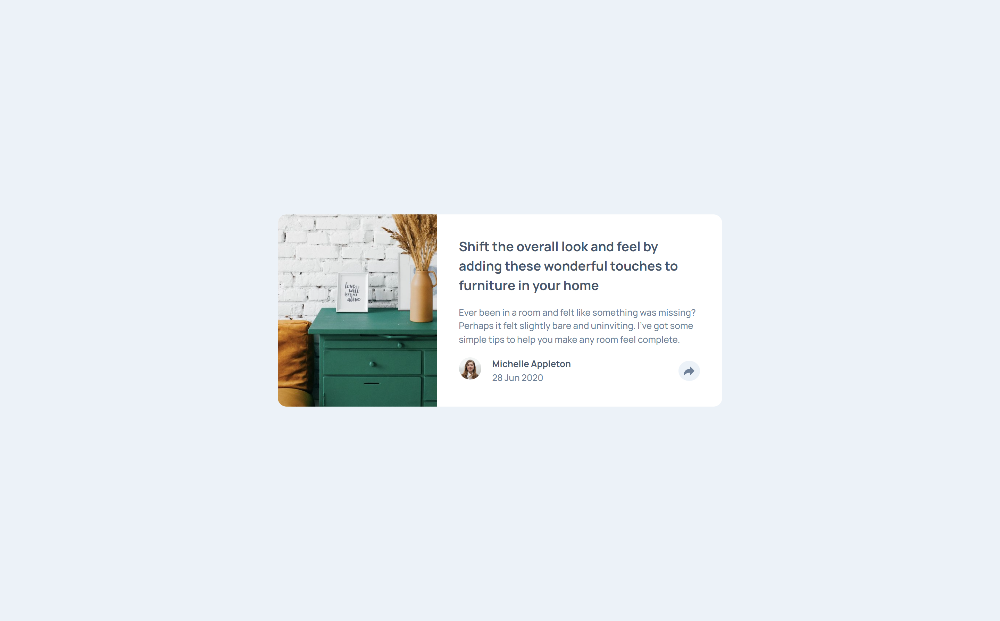

# Frontend Mentor - Article preview component solution

This is a solution to the [Article preview component challenge on Frontend Mentor](https://www.frontendmentor.io/challenges/article-preview-component-dYBN_pYFT). Frontend Mentor challenges help you improve your coding skills by building realistic projects.

## Table of contents

- [Overview](#overview)
  - [The challenge](#the-challenge)
  - [Screenshot](#screenshot)
  - [Links](#links)
- [My process](#my-process)
  - [Built with](#built-with)
  - [What I learned](#what-i-learned)
  - [Useful resources](#useful-resources)
- [Author](#author)
- [Acknowledgments](#acknowledgments)

**Note: Delete this note and update the table of contents based on what sections you keep.**

## Overview

### The challenge

Users should be able to:

- View the optimal layout for the component depending on their device's screen size
- See the social media share links when they click the share icon

### Screenshot

### Links

- Live Site URL: [View Site](https://moojica.github.io/frontend-mentor-article-preview-component/)

## My process

### Built with

- Semantic HTML5 markup
- CSS custom properties
- Flexbox
- JavaScript

### What I learned

Learned how to create a tooltip popup using vanilla CSS. Shoutout to Web Dev Simplified on YouTube for the great tutorial!

### Useful resources

- [Web Dev Simplified](https://www.youtube.com/watch?v=ujlpzTyJp-M&t=1s) - This helped me create a tooltip only using CSS.

## Author

- Website - [Marcos Mujica](https://moojica.github.io/frontend-mentor-social-links-profile/)
- Frontend Mentor - [@moojica](https://www.frontendmentor.io/profile/moojica)

## Acknowledgments

Shoutout to [Web Dev Simplified](https://www.youtube.com/@WebDevSimplified) for the CSS tutorial!
